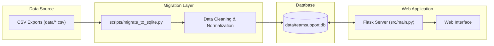

# TeamSupport Archive Viewer

A robust, read-only web interface for browsing and searching historical TeamSupport ticket archives. This application migrates static CSV exports into a high-performance SQLite database to provide a modern, responsive user experience.

---

## 🚀 Quick Start

Follow these steps to get the application running in minutes.

### 1. Prerequisites
- Python 3.8+
- Recommended: A virtual environment

### 2. Installation

```bash
# 1. Create and activate a virtual environment
python -m venv .venv
source .venv/bin/activate  # On Windows: .venv\Scripts\activate

# 2. Install dependencies
pip install -r requirements.txt
```

### 3. Data Setup (One-Time)
Before running the app, you must migrate the CSV data to the local database.

```bash
python scripts/migrate_to_sqlite.py
```

#### Data Sources
The migration script ingests **17 CSV files** spanning from 2017 to 2025:

| Period | Files |
|--------|-------|
| 2017 | `All Ticket Actions - 01-2017_06-2017.csv`, `All Ticket Actions - 07-2017-12-2017.csv` |
| 2018 | `All Ticket Actions - 01-2018_06-2018.csv`, `All Ticket Actions - 07-2018_12-2018.csv` |
| 2019 | `All Ticket Actions - 01-2019_06-2019..csv`, `All Ticket Actions - 07-2019_12-2019.csv` |
| 2020 | `All Ticket Actions - 01-2020_06-2020.csv`, `All Ticket Actions - 07-2020_12-2020.csv` |
| 2021 | `All Ticket Actions - 07-2021_12-2021.csv` |
| 2022 | `All Ticket Actions - 01-2022_06-2022.csv`, `All Ticket Actions - 07-2022_12-2022.csv` |
| 2023 | `All Ticket Actions - 01-2023_06-2023.csv`, `All Ticket Actions - 07-2023_12-2023.csv` |
| 2024 | `All Ticket Actions - 01-2024_06-2024.csv`, `All Ticket Actions - 07-2024_12-2024.csv` |
| 2025 | `All-Ticket-Actions-01-2025_06-2025.csv`, `All-Ticket-Actions-07-2025_12-2025.csv` |

#### Migration Statistics (as of January 2026)

| Metric | Value |
|--------|-------|
| **Total CSV rows** | 881,152 |
| **Visible rows (after filtering)** | 763,137 |
| **Unique tickets** | 177,043 |
| **Database size** | ~1.09 GB |

> **Note:** The migration filters rows where `Is Visible on Hub == True` and pre-cleans message bodies for runtime efficiency. The process typically takes 2-3 minutes.

### 4. Run the Application

```bash
python run.py
```
The server will start at **[http://localhost:5000](http://localhost:5000)**.

---

## 🛠️ What is this doing?

This project is a self-contained archive viewer that consists of three main components ("mini-apps"):

1.  **The Migrator (`scripts/migrate_to_sqlite.py`)**:
    *   **Input**: Reads 17 large CSV export files from `data/` (spanning 2017-2025).
    *   **Processing**: Cleans dirty data, strips email headers/signatures, formats dates, and normalizes whitespace.
    *   **Output**: Produces an optimized SQLite database in `data/teamsupport.db`.

2.  **The Viewer (`src/main.py`)**:
    *   **Engine**: A Flask web server that queries the SQLite database.
    *   **Interface**: Renders ticket lists and details using Jinja2 templates and TailwindCSS.
    *   **Performance**: Uses lazy-loading and database indexing to handle heavily populated views instantly.

3.  **The Exporter (`src/generate_pdf.py`)**:
    *   **Function**: Generates on-the-fly PDF summaries of ticket threads for download.

---

## ✨ Key Features

*   **Fast Search**: Instantly filter by Ticket Number or Subject.
*   **Rich Detail View**: See the full conversation history, with email clutter automatically removed.
*   **Multiple Layouts**: Toggle between 4 different view templates (Standard, Enterprise, Premium) via the `.env` settings.
*   **PDF Export**: Download a clean, printable PDF version of any ticket.
*   **Smart Formatting**:
    *   Auto-links URLs.
    *   Collapses email signatures.
    *   Color-coded status badges (Open, Closed, Pending).

---

## 🏗️ Architecture Overview

The system follows a simple ETL (Extract, Transform, Load) pipeline into a standard MVC web app.



### Database Schema

Two normalized tables allow for efficient storage and retrieval:

*   **`tickets`**: Contains high-level metadata (Status, Owner, Date Created, etc.).
*   **`messages`**: Contains the actual conversation history, linked to tickets.

---

## 📂 Project Structure

| File/Folder | Description |
|---|---|
| `run.py` | **Entry Point**. Run this to start the web server. |
| `src/` | Main application source code. |
| `src/main.py` | Flask application logic. |
| `scripts/` | Maintenance and migration scripts. |
| `data/` | Data storage (Database, CSVs, Excel). |
| `data/teamsupport.db` | The generated SQLite database. |
| `requirements.txt` | Python dependency list. |
| `.env` | Configuration file (e.g., selecting templates). |

---

## ⚙️ Configuration

You can customize the application by editing the `.env` file (created automatically if missing).

| Variable | Default | Options | Description |
|---|---|---|---|
| `TICKET_DETAIL_TEMPLATE` | `ticket_detail` | `ticket_detail`, `ticket_detail2`, `ticket_detail3`, `ticket_detail4` | Changes the layout of the ticket detail page. |
